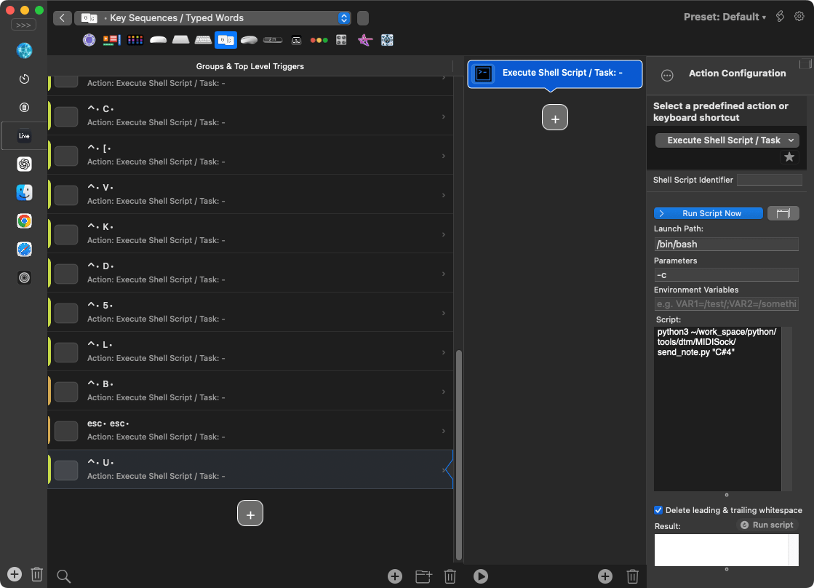

# MIDISock

🌍 **Languages**: **日本語** | [English](README.md)

**MIDIノートを送信する macOS 向けの軽量スクリプト。**  
BetterTouchTool (BTT)／Karabiner-Elements と組み合わせ、DAW の操作トリガーを増やすために作りました。

## ✨ 使い方（概要）
- `server.py` を起動（メニューバー常駐）。
- `send_note.py` を実行し、MIDI ノート On/Off を送信。
- 受信したノートを DAW 側で目的の操作に割り当てて使用。
- `send_note.py` の発火手段として BTT や Karabiner-Elements を想定。

---

## 📌 動作要件
- macOS
- 仮想MIDIポート（IAC Driver を有効化）
- Python 3.9 以上
- 依存ライブラリ：
  - python-rtmidi
  - rumps
  - PyYAML

---

## 🚀 セットアップ（共通）
- [1. macOS: IAC Driver を有効化](#step-1)
- [2. 依存ライブラリのインストール（requirements.txt）](#step-2)
- [3. config.yaml の設定 / 検証](#step-3)
- [4. 起動 / MIDIノート送信](#step-4)

<a id="step-1"></a>
## 1. macOS: IAC Driver を有効化

1. **「Audio MIDI 設定」**を開く  
   Finder → アプリケーション → ユーティリティ → **Audio MIDI 設定.app**

2. メニュー **「ウインドウ」→「MIDI スタジオを表示」** を選ぶ  
   “MIDI スタジオ”ウインドウにデバイス一覧が表示されます。

   

3. **「IAC Driver」** を **ダブルクリック**  

4. **「デバイスは有効（Device is online）」** に **チェック**を入れる  
   これで IAC Driver が有効になります。

   
   
5. （任意）**名称の調整**  
   デバイス名やポート名は任意で変更できます。  
   **表示名を `config.yaml` の `midi.device.name` と `midi.port.name` に設定してください。**

6. 適用を押す（設定は即時反映）

<a id="step-2"></a>
### 2. 依存ライブラリのインストール（requirements.txt）

```bash
python3 -m pip install -r requirements.txt
```

<a id="step-3"></a>
## 3. config.yaml の設定 / 検証

1. **デバイス名とポート名を確認**
```bash
python3 server.py --list
```

例:
```text
❯ python3 server.py --list
IAC_Driver Bus1
```

2. **config.yaml を修正**
```yaml
midi:
  device:
    # どちらか一方を指定: name（完全一致） / regex（正規表現）
    name: "IAC_Driver"
    regex: ""
  port:
    # どちらか一方を指定: name（完全一致） / regex（正規表現）
    name: "Bus1"
    regex: ""
  channel: 1  # 1〜16
```

3. **設定を検証**
```bash
python3 server.py --check
```
例: （OKパターン）
```text
OK  port="IAC_Driver Bus1"  channel=1
```

<a id="step-4"></a>
## 4. 起動 / MIDIノート送信

1. **起動（メニューバー常駐）**
```bash
python3 server.py
```
- 終了: メニューバーの **Quit**
- ソケット: `./midi_trigger.sock`

2. **MIDIノート送信**
```bash
python3 send_note.py "C#4"
```
- 引数は **ノート名**（例: `"C-1"`, `"C#4"`）。ダブルクオート必須。

例（成功）:
```text
SENT
```

---

## 🎛️ 使い方の例（Ableton Live）

- [1. MIDIポートの設定](#live-1)
- [2. MIDI マッピング](#live-2)
- [3. BTT でキーシーケンスを作成](#live-3)

<a id="live-1"></a>
### 1. MIDIポートの設定
1. 設定… → Link, Tempo & MIDI を開く
2. Input Ports → 使用する仮想MIDIポート（例: *IAC_Driver Bus1*）の Remote にチェックを入れる


<a id="live-2"></a>
### 2. MIDI マッピング
1. 右上の **MIDI** をクリックして、MIDIマップモードを有効にする。


  
2. マッピングしたいスイッチなどを選ぶ（例：ボリュームフェーダー）。  
3. MIDI ノートを送信。
   
   ```bash
   python3 send_note.py "C#4"
   ```
   
4. MIDIマップモードを無効にする。  

<a id="live-3"></a>
### 3. BTT でキーシーケンスを作成
1. **トリガー**：例: Ctrl → U



2. **アクション**：**Run Shell Script / Task** にトリガーを設定

   ```bash
   python3 /path/to/send_note.py "C#4"
   ```


> [!NOTE]
> "認識後に入力した文字を削除します" のチェックを外す

3. 保存してテスト（Live で割り当てた操作が発火することを確認）

> [!TIP]
> **Max for Live 連携**  
> LoadeR や Shortcut Buddy と組み合わせて、プラグインや Live のストックデバイスをすばやく呼び出せます。
> - LoadeR — [maxforlive.com](https://maxforlive.com/library/device/7390/loader-load-devices-with-shortcuts) / [Gumroad](https://valiumdupeuple.gumroad.com/l/agUro)
> - Shortcut Buddy — [maxforlive.com](https://maxforlive.com/library/device/9058/shortcut-buddy) / [Noir Labs](https://www.noirlabs.co/)

---

## 🛠️ コマンド・リファレンス

### server.py
- `python3 server.py --list`  
  利用可能な MIDI OUT ポート名を表示（文字化け補正済み）。
- `python3 server.py --check`  
  `config.yaml` を検証し、選択されるポート名とチャンネルを表示して終了（常駐しない）。
- `python3 server.py`  
  常駐起動（メニューバー常駐）。UNIX ソケット `./midi_trigger.sock` を生成。終了はメニューバーの **Quit**。
- ログ出力：標準エラー出力（STDERR）に `[MIDISock][INFO/WARN/ERROR/DEBUG]` を出力。
- 二重起動：既に起動中なら即時終了（リソース消費なし）。
- ソケット：起動時に残存ソケットを自動削除し、パーミッション `0600` で作成。

### send_note.py
- `python3 send_note.py "C#4"`  
  引数は **ノート名**（例：`"C-1"`, `"C#4"`）。**ダブルクオート必須**。
- 出力（STDOUT）  
  - 成功：`SENT`  
  - 失敗：`ERR: ...`（例：`ERR: connect failed (...)` など）
- 終了コード  
  - `0`：成功（`SENT`）  
  - `1`：引数なし（ノート名未指定）  
  - `2`：接続失敗（connect failed）  
  - `3`：送信失敗（send failed）  
  - `4`：受信失敗（recv failed）※通常は発生しない  
- 備考：`server.py` と同じフォルダの `midi_trigger.sock` を利用（同一フォルダ配置を推奨）。

### 環境変数
- `MIDISOCK_DEBUG=1`  
  デバッグログ（`[DEBUG]`）を有効化。

---

## ライセンス
MIT License — 詳細は [LICENSE](./LICENSE) を参照。
