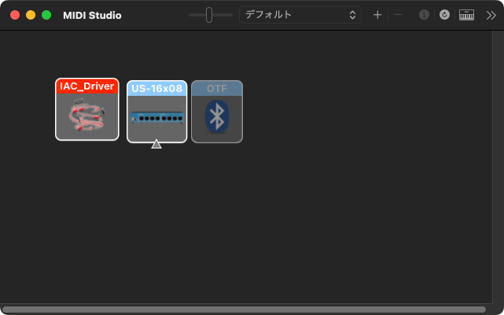
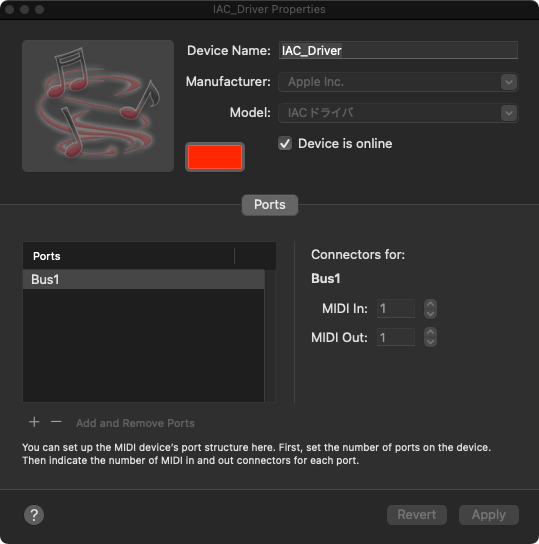

# MIDISock

🌍 **Languages**: **English** | [Japanese](README-ja.md)

**A lightweight macOS script that sends MIDI notes.**  
Built to add more DAW triggers when paired with BetterTouchTool (BTT) or Karabiner-Elements.

## ✨ Usage Overview
- Launch `server.py` (menu bar resident).
- Run `send_note.py` to send a MIDI Note On/Off.
- Assign the received note to the desired action on the DAW side.
- `send_note.py` is intended to be triggered by BTT or Karabiner-Elements.

---

## 📌 Requirements
- macOS
- Virtual MIDI port (enable IAC Driver)
- Python 3.9+
- Dependencies:
  - python-rtmidi
  - rumps
  - PyYAML

---

## 🚀 Setup (Common)
- [1. macOS: Enable IAC Driver](#step-1)
- [2. Install dependencies (requirements.txt)](#step-2)
- [3. Configure / verify `config.yaml`](#step-3)
- [4. Launch the server and send MIDI notes](#step-4)

<a id="step-1"></a>
## 1. macOS: Enable IAC Driver

1. Open **Audio MIDI Setup**  
   Finder → Applications → Utilities → **Audio MIDI Setup.app**

2. Choose menu **Window → Show MIDI Studio**  
   The “MIDI Studio” window shows the device list.

   

3. **Double-click “IAC Driver”**

4. Check **“Device is online”**  
   This enables the IAC Driver.

   
   
5. (Optional) **Adjust names**  
   Device/port names can be changed as you like.  
   **Copy the visible port name into `config.yaml` → `midi.device.name` and `midi.port.name`.**

6. Click **Apply** (settings take effect immediately)

<a id="step-2"></a>
### 2. Install dependencies (requirements.txt)

```bash
python3 -m pip install -r requirements.txt
```

<a id="step-3"></a>
## 3. Configure / verify `config.yaml`

1. **List device and port names**
```bash
python3 server.py --list
```

Example:
```text
❯ python3 server.py --list
IAC_Driver Bus1
```

2. **Edit `config.yaml`**
```yaml
midi:
  device:
    # Specify either one: name (exact match) OR regex (regular expression)
    name: "IAC_Driver"
    regex: ""
  port:
    # Specify either one: name (exact match) OR regex (regular expression)
    name: "Bus1"
    regex: ""
  channel: 1  # 1–16
```

3. **Verify settings**
```bash
python3 server.py --check
```
Example (OK):
```text
OK  port="IAC_Driver Bus1"  channel=1
```

<a id="step-4"></a>
## 4. Launch the server and send MIDI notes

1. **Run (menu bar resident)**
```bash
python3 server.py
```
- Quit: menu bar **Quit**
- Socket: `./midi_trigger.sock`

2. **Send a MIDI note**
```bash
python3 send_note.py "C#4"
```
- The argument must be a **note name** (e.g., `"C-1"`, `"C#4"`). **Double quotes are required.**

Example (success):
```text
SENT
```

---

## 🎛️ Example (Ableton Live)

- [1. MIDI port setup](#live-1)
- [2. MIDI mapping](#live-2)
- [3. Create a key sequence in BTT](#live-3)

<a id="live-1"></a>
### 1. MIDI port setup
1. Open Settings → Link, Tempo & MIDI
2. In **Input Ports**, enable **Remote** for the virtual MIDI port you use (e.g., *IAC_Driver Bus1*).


<a id="live-2"></a>
### 2. MIDI mapping
1. Click **MIDI** (top right) to enable MIDI Map Mode.


  
2. Select the target control to map (e.g., a volume fader).  
3. Send a MIDI note.
   
   ```bash
   python3 send_note.py "C#4"
   ```
   
4. Turn MIDI Map Mode off.

<a id="live-3"></a>
### 3. Create a key sequence in BTT
1. **Trigger**: e.g., Ctrl → U


2. **Action**: **Execute Shell Script / Task** with the command:

```bash
python3 /path/to/send_note.py "C#4"
```


> [!NOTE]
> Uncheck **“Delete typed characters after recognition.”**

3. Save and test (confirm the mapped action in Live is triggered)

> [!TIP]
> **Max for Live integration**  
> Combine MIDISock with LoadeR or Shortcut Buddy to quickly call up plugins and Live’s stock devices.
> - LoadeR — [maxforlive.com](https://maxforlive.com/library/device/7390/loader-load-devices-with-shortcuts) / [Gumroad](https://valiumdupeuple.gumroad.com/l/agUro)
> - Shortcut Buddy — [maxforlive.com](https://maxforlive.com/library/device/9058/shortcut-buddy) / [Noir Labs](https://www.noirlabs.co/)

---

## 🛠️ Command Reference

### server.py
- `python3 server.py --list`  
  List available MIDI OUT port names (with encoding issues auto-corrected).
- `python3 server.py --check`  
  Validate `config.yaml`, print the selected port and channel, then exit (no daemon).
- `python3 server.py`  
  Launch as a menu bar daemon. Creates UNIX socket `./midi_trigger.sock`. Quit via menu bar **Quit**.
- Logging: outputs to standard error (STDERR) with `[MIDISock][INFO/WARN/ERROR/DEBUG]`.
- Duplicate launch: if already running, exits immediately (no resource cost).
- Socket: removes any residual socket at start; creates with permission `0600`.

### send_note.py
- `python3 send_note.py "C#4"`  
  The argument must be a **note name** (e.g., `"C-1"`, `"C#4"`). **Double quotes are required**.
- Output (STDOUT)  
  - Success: `SENT`  
  - Failure: `ERR: ...` (e.g., `ERR: connect failed (...)`)
- Exit codes  
  - `0`: success (`SENT`)  
  - `1`: no argument (note name not specified)  
  - `2`: connection failed  
  - `3`: send failed  
  - `4`: receive failed (typically does not occur)  
- Note: uses `midi_trigger.sock` in the same folder as `server.py` (keep both in one folder).

### Environment Variables
- `MIDISOCK_DEBUG=1`  
  Enable debug logs (`[DEBUG]`).

---

## License
MIT License — see [LICENSE](./LICENSE) for details.
